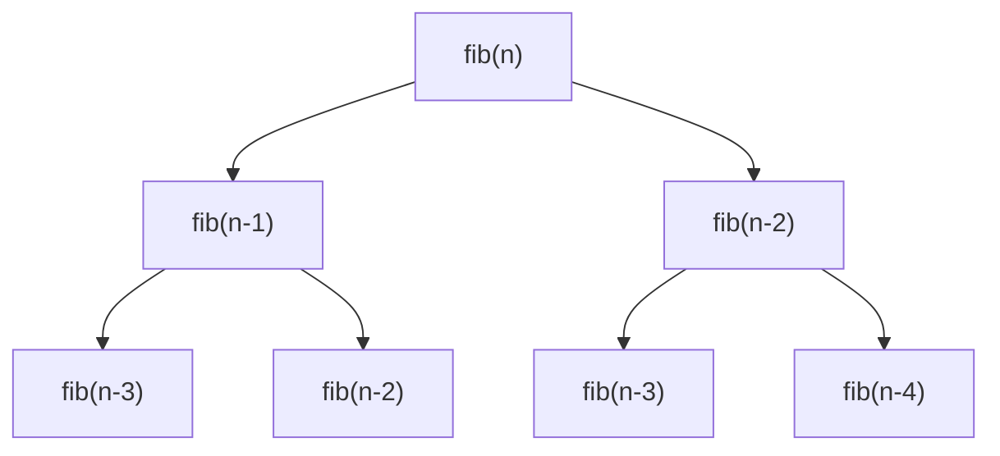

## Introduction

Dynamic programming isn't really an algorithm - it's more like a way of thinking. Classic DP problems include the knapsack problem, the longest common subsequence, shortest path, and many more. We'll get to those later.

When solving DP problem, it helps to follow a clear structure. Here's the one we'll use:

- Define the **state**
- Find the **state transition equation**
- Initialize the **base cases**
- Decide the **traversal order**
- Return the **answer**

Let's walk through this with a classic example: the Fibonacci sequence.

We have: 

$$F(n) = F(n-1) + F(n-2)$$

#### 1. Define the state

To compute $F(n)$, We need $F(n-1)$ and $F(n-2)$. That means we need all previous values from $1$ up to $n-1$. So the state can be simply **the value of the i-th term**.

#### 2. State transition equation

This one is obvious:

$$F(n) = F(n-1)+F(n-2)$$

#### 3. Base cases

We can't start without the first two values. That's our base:

- $F(0) = 0$
- $F(1) = 1$

#### 4. Traversal order

We loop from $i = 2$ to $i = n$ , in increasing order.

#### 5. Return the answer

That's just $F(n)$, the n-th term.

Here's a direct recursive implementation:

```python
def fib(n):
    if n == 0:
        return 0
    elif n == 1:
        return 1
    return fib(n-2)+fib(n-1)
```

Looks clean, right? But let's check the time it takes to compute the first 40 terms:


After the 30th term, things slow down dramatically. Computing the 100th term? Almost impossible. Why?

Because of repeated work. Here's what the call tree looks like:



You can see the same values being recalculated over and over. The bigger n gets, the worse it becomes.

So how do we fix it? Memoization - storing results we've already computed.

```python
def fib(n):
    if n <= 1:
        return n
    dp = [0]*(n+1)
    dp[0] = 1
    dp[1] = 1
    for i in range(2,n+1):
            dp[i] = dp[i-1] + dp[i-2]
    return dp[n]
```


Now it's fast - no matter how large n is.

But do we really need to store the entire array?

No. To compute the n-th term, we only need the previous two values. Everything before that is irrelevant.

So we can optimize further:

```python
def fib(n):
    if n <= 1:
        return n
    a, b = 0, 1
    for i in range(2, n+1):
        a, b = b, a+b
    return b
```

Perfect. This is the classic `O(1)` space, `O(n)` time solution.

Next up: let's apply the same thinking to a real LeetCode problem - **Problem 70: Climbing Stairs.**
